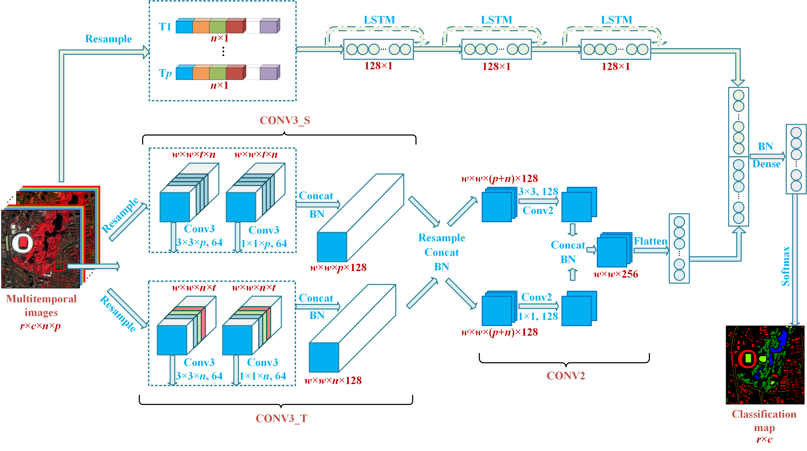

# MDFN for Short-Term Multitemporal HR Images Classification

It is the python-keras implementation of the paper:  A Novel Multitemporal Deep Fusion Network (MDFN) for Short-Term Multitemporal HR Images Classification

For more ore information, please see our published paper at [IEEE JSTARS](https://ieeexplore.ieee.org/document/9573468)



## Prerequisites
```
Window 10
Python 3.6
CPU or NVIDIA GPU
CUDA 9.0
Keras 2.2.4
```
## Quick Start

You can run a demo to get started. 

```bash
python MDFN_demo.py
```

## Prepare Datasets

## Using other dataset mode

In this case, the data structure should be the following:

```
"""
Image classification data set with pixel-level binary labels；
├─Image_T1 & Image_T2 & Image_T3...
├─label
├─train_set
└─test_set
"""
```

## Citation

If you use this code for your research, please cite our papers.

```
@ARTICLE{9573468,  
author={Zheng, Yongjie and Liu, Sicong and Du, Qian and Zhao, Hui and Tong, Xiaohua and Dalponte, Michele},  
journal={IEEE Journal of Selected Topics in Applied Earth Observations and Remote Sensing},   
title={A Novel Multitemporal Deep Fusion Network (MDFN) for Short-Term Multitemporal HR Images Classification},   
year={2021},  
volume={14},  
number={},  
pages={10691-10704},  
doi={10.1109/JSTARS.2021.3119942}
}
```

## Acknowledgments

Our code is inspired by [keras-SSUN](https://github.com/YonghaoXu/SSUN).

 
